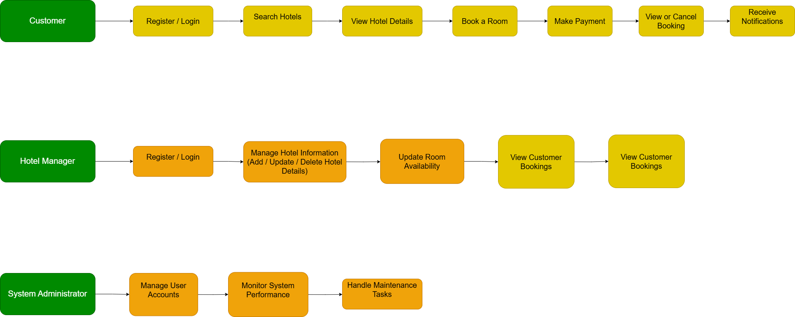

**Requirement Analysis in Software Development.**

This repository outlines the steps involved in the requirement analysis of the Airbnb booking management system clone, emphasizing both the functional and non-functional requirements of the project. The goal of this analysis is to ensure a clear understanding of user needs and system expectations before the design and development phases begin. It also serves as a foundation for building a scalable, efficient, and user-friendly platform that mirrors real-world booking management systems.

**What is Requirement Analysis?**

Requirement Analysis is a critical phase in the Software Development Life Cycle (SDLC) where the project team identifies, gathers, and defines the needs and expectations of stakeholders for the software system to be developed. It serves as the foundation for all subsequent stages of development, ensuring that the final product aligns with the user’s goals and business objectives.

During this phase, analysts, developers, and stakeholders collaborate to understand what the system should do and how it should perform. The process involves collecting requirements through techniques like interviews, surveys, brainstorming sessions, and document analysis. These requirements are then analyzed, categorized, and documented clearly for further use in design and development.

Importance of Requirement Analysis

Prevents misunderstandings: It ensures all parties have a shared understanding of the project’s scope and functionality.

Improves quality: Well-defined requirements lead to better system design and implementation.

Saves time and cost: Detecting issues early in the requirement stage helps avoid costly fixes later in development.

Guides development: It provides a roadmap for developers and testers to follow throughout the project lifecycle.

Ensures user satisfaction: By focusing on user needs, the final product is more likely to meet expectations and achieve business goals.

**Why is Requirement Analysis Important?**

Requirement Analysis plays a vital role in ensuring the success of any software development project. It helps bridge the communication gap between stakeholders and developers, setting a strong foundation for building a reliable and efficient system. Below are three key reasons why it is critical in the Software Development Life Cycle (SDLC):

1. Ensures Clear Understanding of Project Goals

Requirement Analysis helps developers and stakeholders establish a common understanding of the system’s purpose, features, and limitations. By clarifying expectations early, it reduces confusion and ensures everyone is aligned on what the final product should achieve.

2. Reduces Development Costs and Time

Identifying requirements at the start helps detect potential issues, conflicts, or missing features before coding begins. This minimizes the need for rework later in the process, saving both time and resources that could be wasted on fixing preventable errors.

3. Improves System Quality and User Satisfaction

When requirements are well-defined and accurately documented, the development team can design a system that meets user needs more effectively. This leads to a higher-quality product that performs reliably and provides a better user experience.

**Key Activities in Requirement Analysis.**

The Requirement Analysis phase involves several structured activities to ensure that all user and business needs are clearly understood, documented, and validated before development begins. Below are the five key activities carried out during this stage:

1. Requirement Gathering

This involves collecting information about what the users and stakeholders expect from the system. Data is gathered through methods such as interviews, surveys, observations, and document reviews. The goal is to capture all possible needs and constraints that will shape the software.

2. Requirement Elicitation

In this step, deeper insights are obtained by engaging stakeholders to refine and clarify their needs. Techniques like brainstorming sessions, workshops, use case studies, and prototyping are used to uncover hidden or implicit requirements that may not have been initially stated.

3. Requirement Documentation

All gathered and elicited requirements are formally documented in clear, structured formats such as the Software Requirements Specification (SRS) document. This ensures that the requirements are accessible, understandable, and traceable throughout the development process.

4. Requirement Analysis and Modeling

Here, the documented requirements are analyzed for feasibility, consistency, and completeness. Modeling techniques like data flow diagrams, entity-relationship diagrams, and use case models are used to visualize and validate system functionality before implementation begins.

5. Requirement Validation

The final step ensures that all documented requirements accurately reflect stakeholder needs and are achievable within the project’s scope, time, and budget. This involves reviewing, inspecting, and validating requirements with stakeholders to confirm alignment and avoid misunderstandings later.

**Types of Requirements.**

In software engineering, system requirements are generally categorized into Functional Requirements and Non-functional Requirements.
Both are essential to ensure that the system performs as expected and delivers a smooth, reliable user experience. Below are their definitions and examples for the Booking Management System (similar to Airbnb, OYO, or Booking.com).

**Functional Requirements**

**Definition:**
Functional requirements describe what the system should do.
They define specific behaviors, actions, and functions that the software must perform to meet user and business needs.

**Examples for the Booking Management Project:**

User Authentication:
The system should allow users (both customers and hotel managers) to register, log in, and log out securely.

Hotel Listing Management:
Hotel managers should be able to add, update, or delete hotel details, including room types, prices, and availability.

Search and Filter Functionality:
Customers should be able to search for hotels based on location, date, price range, and amenities.

Booking and Payment Processing:
Customers should be able to book available rooms and complete secure payments through integrated third-party payment services.

View and Manage Bookings:
Both customers and managers should be able to view, update, or cancel bookings from their respective dashboards.

Notification System:
The system should send notifications to customers and managers when bookings, updates, or offers occur.

**Non-functional Requirements**

**Definition:**
Non-functional requirements describe how the system performs its functions.
They define quality attributes such as performance, reliability, usability, scalability, and security that determine the system’s overall effectiveness.

**Examples for the Booking Management Project:**

Performance:
The system should handle high user traffic efficiently through a microservice architecture and load balancers to ensure fast response times.

Scalability:
The system should be able to scale horizontally to accommodate an increasing number of users, hotels, and bookings.

Reliability:
The database should use a master-slave setup to ensure data consistency and availability even if one server fails.

Security:
All sensitive user data (login credentials, payment details) should be encrypted and transmitted securely.

Availability:
The system should be accessible 24/7 with minimal downtime, supported by distributed servers and caching (Redis, CDN).

Usability:
The interface should be intuitive and easy to navigate for both hotel managers and customers.

**Use Case Diagrams.**

**What is a Use Case Diagram?**

A Use Case Diagram is a visual representation of how users (called actors) interact with a system to achieve specific goals.
It shows the relationships between actors and the various system functionalities (use cases), providing a clear overview of what the system does from the user’s perspective.

Use Case Diagrams are a key part of Requirement Analysis because they help in identifying user needs, system boundaries, and functional requirements.

**Benefits of Use Case Diagrams**

Simplifies understanding: Clearly illustrates system functionality in a visual and easy-to-understand format.

Enhances communication: Serves as a bridge between technical and non-technical stakeholders.

Identifies missing requirements: Helps ensure no major function or actor is overlooked.

Guides system design: Acts as a blueprint for defining interactions and relationships between components.

**Use Case Diagram (Visual)**

